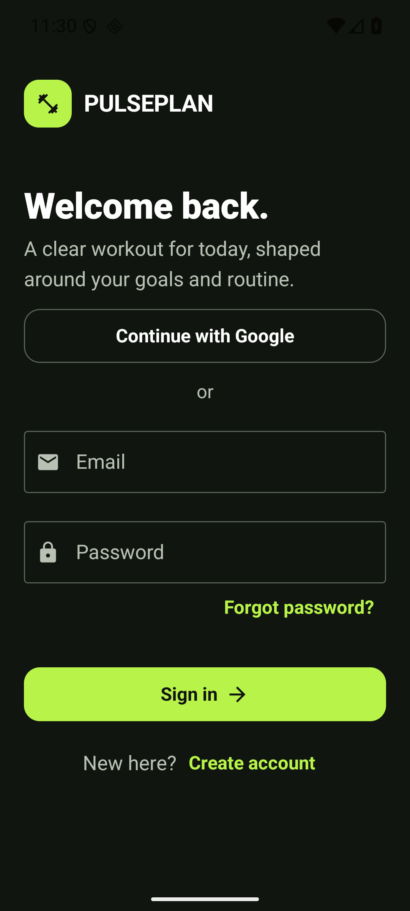

# PulsePlan

I built PulsePlan as an Android workout planner with Kotlin and Jetpack Compose.
It creates a daily plan from a user's goal, experience, workout personality,
equipment, schedule, and preferred session length.

**[View my portfolio](https://ahsanrehmat1.github.io)**



New to the project? Start with my plain-language
[beginner guide](docs/BEGINNER_GUIDE.md).

## Current vertical slice

- Email/password sign-in and registration through Firebase Authentication
- Password-reset email flow for returning users
- Timestamped offline-first Firestore sync for profiles, reminders, progress,
  and exercise alternatives
- Visible cloud state: syncing, up to date, local only, or setup pending
- Safe preview mode while Firebase is not configured
- Personalized onboarding
- Six structured movement preferences with automatic exercise filtering
- Clear adjustment reasons while preserving honest completion history
- Deterministic daily and weekly workout generation
- Exercise completion persistence with DataStore
- Editable per-account daily reminder with WorkManager
- Clear recovery path when Android notifications are disabled
- Focused active-workout mode with exercise progression
- Pauseable and skippable rest countdowns
- Local 28-day workout history and weekly completion summary
- Fair workout streaks that ignore recovery days
- Editable plan preferences with immediate workout regeneration
- Step-by-step guides for every generated exercise
- Exact real-video tutorial searches from every exercise guide
- One-tap same-equipment exercise alternatives saved for the current date
- Material 3 Compose interface

## Toolchain

- JDK 17
- Android Studio with Android SDK 36
- Android Gradle Plugin 9.3.1
- Gradle 9.6.1

I do not commit secrets to this repository. Version 0.11.0 contains the account
and cloud-sync code, but I have not yet verified live Firebase registration and
synchronization with a real project.

To enable real accounts, create a Firebase Android app whose package is
`com.ahsanrehmat.pulseplan`, enable Email/Password under Firebase
Authentication, create a Cloud Firestore database, publish the checked-in
`firestore.rules`, and add these values to the untracked `local.properties`
file:

```properties
sdk.dir=C\:\\Users\\YOUR_NAME\\AppData\\Local\\Android\\Sdk
firebase.apiKey=YOUR_WEB_API_KEY
firebase.appId=YOUR_FIREBASE_APP_ID
firebase.projectId=YOUR_FIREBASE_PROJECT_ID
```

Without those Firebase values, **Preview the app** remains available so the
onboarding and workout flow can be tested safely. Preview data stays local and
is never uploaded under a pretend account.

## Build

Open the repository in Android Studio, allow Gradle sync to complete, and run
the `app` configuration on an Android 8.0+ device or emulator.

```powershell
./gradlew.bat test
./gradlew.bat assembleDebug
```

See [docs/PRODUCT.md](docs/PRODUCT.md) for product scope and safety boundaries.
