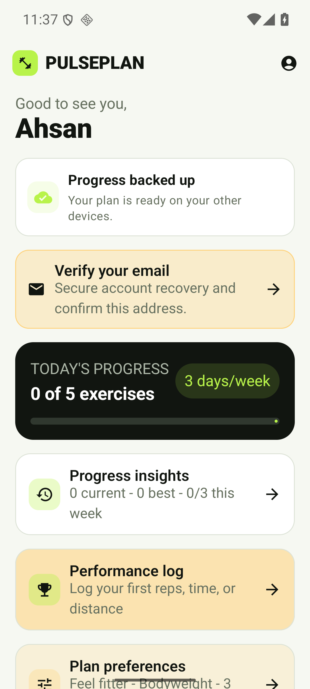
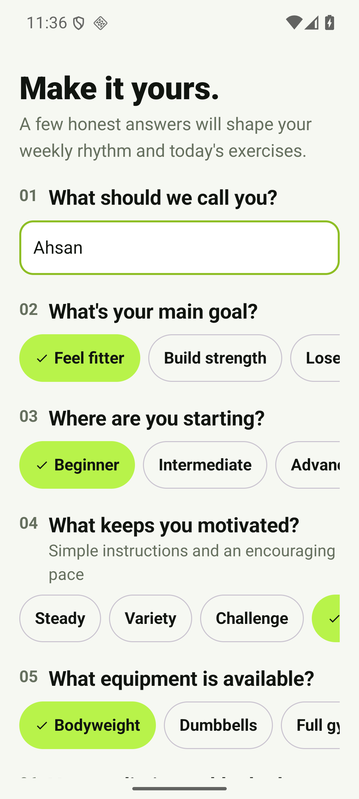
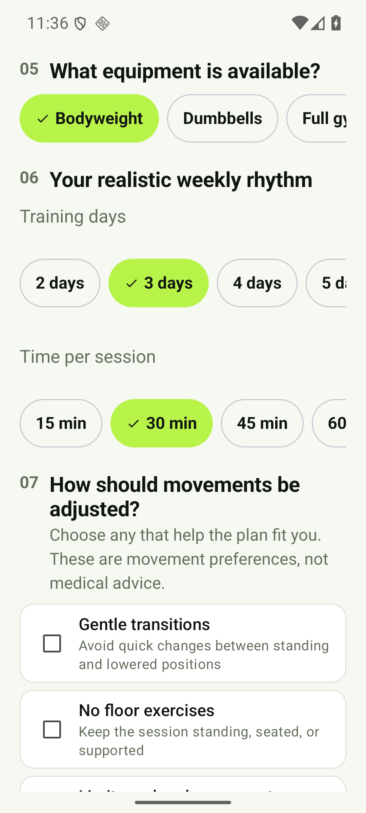
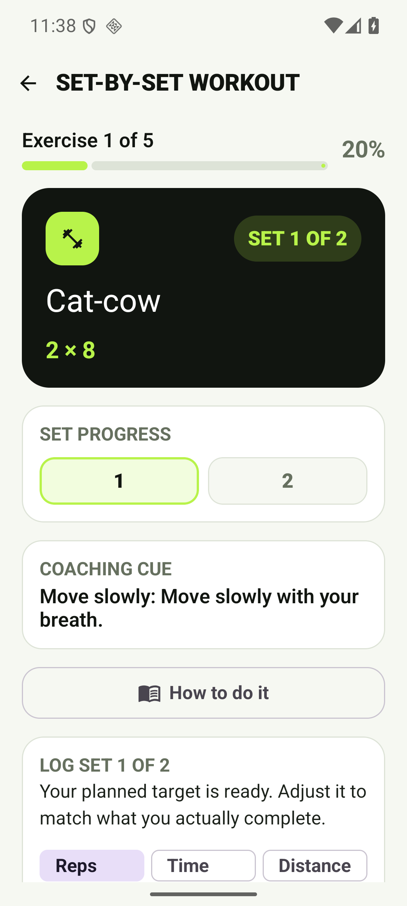
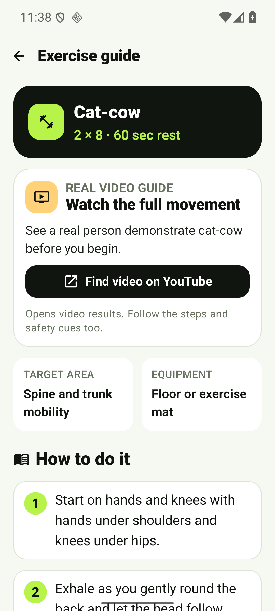
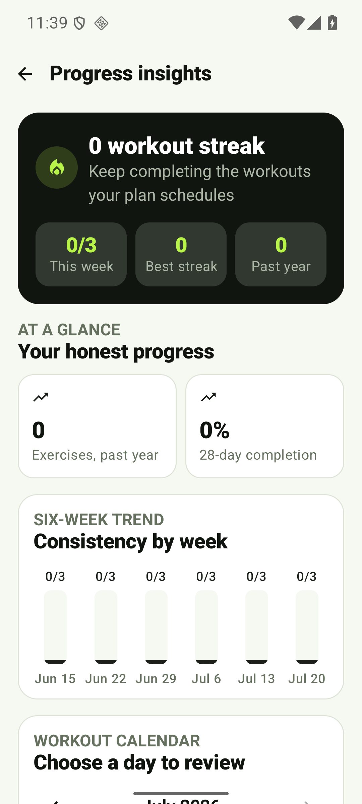
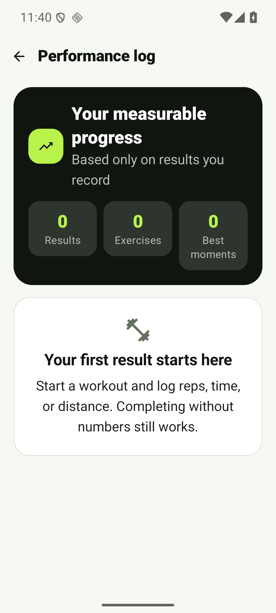

# PulsePlan

[](https://github.com/ahsanrehmat1/PulsePlan/actions/workflows/android-ci.yml)

I built PulsePlan as an Android workout planner with Kotlin and Jetpack Compose.
It creates a daily plan from a user's goal, experience, workout personality,
equipment, schedule, and preferred session length.

**[View my portfolio](https://ahsanrehmat1.github.io)**

## Download PulsePlan

**[Download PulsePlan v0.19.0 for Android](https://github.com/ahsanrehmat1/PulsePlan/releases/download/v0.19.0/PulsePlan-v0.19.0.apk)**

This signed public beta supports Android 8.0 and newer. Because it is
distributed directly through GitHub rather than Google Play, Android may ask
you to allow installation from your browser or file manager. The matching
SHA-256 checksum is included with the release.

<p align="center">
  
</p>

New to the project? Start with my plain-language
[beginner guide](docs/BEGINNER_GUIDE.md).

## Current app walkthrough

<table>
  <tr>
    <td align="center" width="25%">
      
      <br /><sub>Firebase sign-in</sub>
    </td>
    <td align="center" width="25%">
      
      <br /><sub>Personalized onboarding</sub>
    </td>
    <td align="center" width="25%">
      
      <br /><sub>Plan preferences</sub>
    </td>
    <td align="center" width="25%">
      
      <br /><sub>Set-by-set workouts</sub>
    </td>
  </tr>
  <tr>
    <td align="center" width="25%">
      
      <br /><sub>Exercise guidance</sub>
    </td>
    <td align="center" width="25%">
      
      <br /><sub>Progress insights</sub>
    </td>
    <td align="center" width="25%">
      
      <br /><sub>Performance logging</sub>
    </td>
    <td align="center" width="25%">
      
      <br /><sub>Cloud-backed dashboard</sub>
    </td>
  </tr>
</table>

## Current vertical slice

- Google and email/password sign-in through Firebase Authentication
- Password-reset email flow for returning users
- Email verification status with send, resend, and refresh controls
- Account & Privacy center with plain-language data-use information
- Provider-confirmed account and data deletion
- Firebase Crashlytics reporting for crashes, ANRs, and non-fatal errors
- Public privacy policy and account-deletion request pages
- Timestamped offline-first Firestore sync for profiles, reminders, progress,
  exercise results, and exercise alternatives
- Clear cloud-backup status
- Personalized onboarding
- Six structured movement preferences with automatic exercise filtering
- Clear adjustment reasons while preserving honest completion history
- Deterministic daily and weekly workout generation
- Exercise completion persistence with DataStore
- Editable per-account daily reminder with WorkManager
- Clear recovery path when Android notifications are disabled
- Focused active-workout mode with exercise progression
- Pauseable and skippable rest countdowns
- Active-workout restoration after an app-process interruption
- Set-by-set tracking with editable reps, weight, time, or distance for each set
- Automatic between-set rest plus start, pause, resume, reset, and skip controls
- Exercise-specific countdown timers for timed sets
- Set totals, reps, training volume, timed work, and distance in the session summary
- Optional result entry for reps, weight, time, distance, effort, and notes
- Automatic personal-best detection with previous-result comparison
- Explainable next-target suggestions based on the user's goal and recorded effort
- One-tap use of a small reps, weight, time, or distance progression
- Exercise-specific performance history and six-result trend charts
- Confirmed result deletion for correcting an accidental log
- Interactive 365-day workout calendar with per-date exercise review
- Six-week completion trend, 28-day completion rate, and past-year totals
- Current and best workout streaks with honest recovery-day handling
- Progress milestones based only on recorded workout activity
- Fair workout streaks that ignore recovery days
- Editable plan preferences with immediate workout regeneration
- Step-by-step guides for every generated exercise
- Exact real-video tutorial searches from every exercise guide
- One-tap same-equipment exercise alternatives saved for the current date
- Material 3 Compose interface

## Toolchain

- JDK 17
- Android Studio with Android SDK 36
- Android Gradle Plugin 9.3.1
- Gradle 9.6.1

I do not commit secrets to this repository. Version 0.19.0 is connected on the
current development machine to the Firebase project `pulseplan-503519`.
Email/password registration, sign-out and sign-in, password-reset dispatch,
Firestore upload, and profile restoration after clearing all local app data
have been verified on a clean emulator. Google Sign-In and provider-aware
account deletion are also working on a physical Android device. Version 0.19.0
adds Crashlytics and public Play Store policy pages. A controlled fatal report
was verified in the Firebase dashboard from an SM-N986N. Disposable-account
deletion was verified end to end on an isolated Android 16 emulator: the
Authentication user, Firestore document, local account data, and scheduled
background work were removed, and the deleted credentials could not sign in.

- [Privacy policy](https://ahsanrehmat1.github.io/pulseplan-privacy.html)
- [Account deletion](https://ahsanrehmat1.github.io/pulseplan-delete-account.html)

To connect another development machine or Firebase project, create a Firebase
Android app whose package is
`com.ahsanrehmat.pulseplan`, enable Email/Password and Google under Firebase
Authentication, create a Cloud Firestore database, publish the checked-in
`firestore.rules`, add the app's SHA-1 certificate, and add these values to the
untracked `local.properties` file:

```properties
sdk.dir=C\:\\Users\\YOUR_NAME\\AppData\\Local\\Android\\Sdk
firebase.apiKey=YOUR_WEB_API_KEY
firebase.appId=YOUR_FIREBASE_APP_ID
firebase.projectId=YOUR_FIREBASE_PROJECT_ID
google.webClientId=YOUR_WEB_OAUTH_CLIENT_ID
```

Without these values, account sign-in is unavailable.

## Build

Open the repository in Android Studio, allow Gradle sync to complete, and run
the `app` configuration on an Android 8.0+ device or emulator.

```powershell
./gradlew.bat test
./gradlew.bat assembleDebug
```

See [docs/PRODUCT.md](docs/PRODUCT.md) for product scope and safety boundaries.
